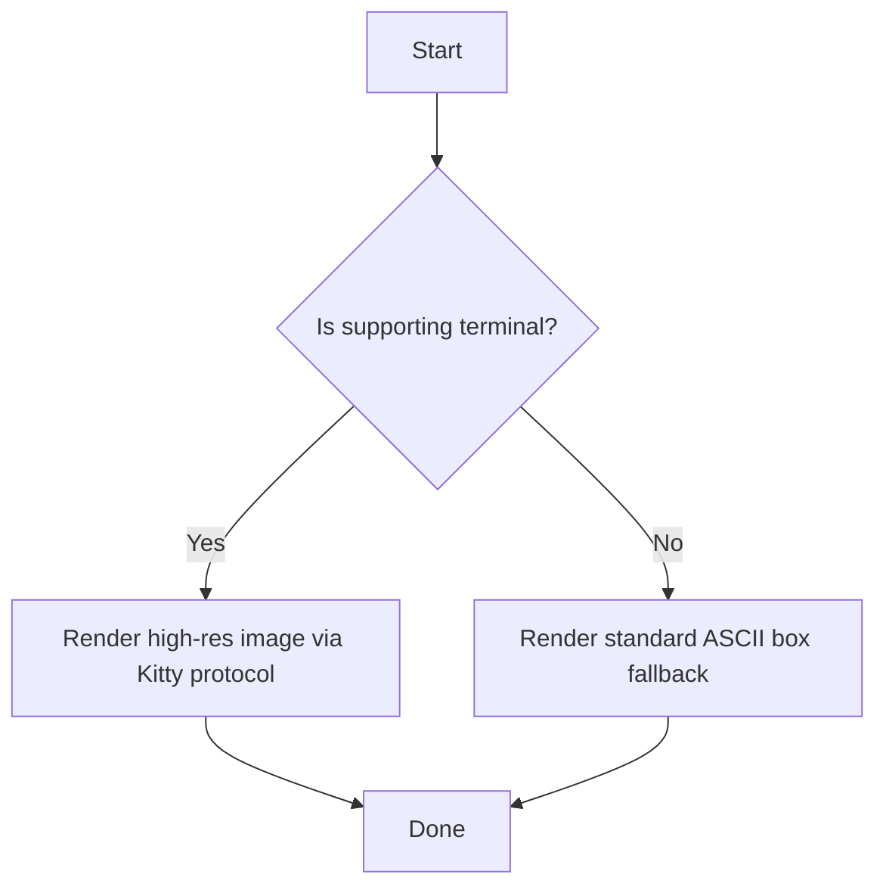

# Test Document: Markdown Renderer `md`

This is a demonstration of the `md` command-line utility. This paragraph contains some longer text to test word wrapping at word boundaries in the top-level section. It should span multiple lines cleanly and wrap appropriately when rendered at various terminal widths. In addition, we are adding extra text to make sure that the wrapping behavior is perfectly clear, ensuring that long sentences flow naturally from line to line without overflowing or cutting off words in the middle.

## Elements

### Inline styles
This is **bold** text, *italic* text, and ~strikethrough~ text. You can also write a `code span` inline. Here is a longer inline styles paragraph to test wrapping inside nested sections: wrapping is extremely important for readability, ensuring that text does not exceed the terminal width and breaks correctly at word boundaries. When we nest block elements inside headings, we want to ensure that all text elements align correctly with the indentation of the parent heading level.

### Lists
Here is an unordered list with longer items to verify nested list item line wrapping:
- Level 1 Item A: This is a longer list item to test if wrapping works properly on lists. The wrapped lines should be correctly aligned with the start of the list item text rather than starting at the left margin. This ensures that the bullets remain clean and visible on the left side while the body of the list item text wraps cleanly as a cohesive block.
- Level 1 Item B: A standard list item.
  - Level 2 Item B1: This is a nested level 2 list item with a longer paragraph of text to verify wrapping behavior at deeper levels of list nesting. It should align with the start of the level 2 list item text, which is indented further to the right than the level 1 list items.
  - Level 2 Item B2: Another nested level 2 item.
- Level 1 Item C: Final item of the unordered list.

And an ordered list:
1. First step: Clean up all double newlines and enforce consistent block spacing. This is a longer description for the first step to test how ordered list items wrap. The numbers on the left should be colored green, and all subsequent lines of this step should be aligned with the text of the step.
2. Second step: Enforce document-wide indentation matching the header level nesting.
3. Third step: Verify everything works on diverse terminal sizes and handles custom themes like Catppuccin Mocha.

### Blockquotes
> This is a blockquote. It can span multiple lines. Here is a longer sentence inside a blockquote to verify that it wraps at the correct boundary and preserves the blockquote prefix at the beginning of each wrapped line. The blockquote prefix vertical lines should align with the current document indentation.
> > Nested blockquotes are also supported! They should align properly and have their text wrap correctly within the reduced width. This is an even longer paragraph within a nested blockquote to ensure that we can see how the double vertical lines `│ │` look when they are repeated on every single wrapped line of the quote.

### Tables

| Feature | Standard Trie | Radix Tree | Patricia Trie |
| :--- | :--- | :--- | :--- |
| Edge Labels | Single character or bit | Variable-length strings or bit-strings | No text labels; just a bit-index pointing to the next branch |
| Node Sparsity | High (lots of single-child nodes) | Low (no single-child nodes) | Low (every internal node has exactly two children) |
| Memory Footprint | Massive / Inefficient | Moderately Compact | Highly Compact (ideal for raw bitwise routing) |


---

# Math Equations (LaTeX)

Here is an inline equation: $e^{i\pi} + 1 = 0$ inside a normal paragraph.

And a display equation:
$$
\int_{-\infty}^{\infty} e^{-x^2} dx = \sqrt{\pi}
$$

---

# Mermaid Diagrams



---

# Code Blocks

### Rust Code Block

```rust
fn main() {
    // A simple greeting
    let greeting = "Hello, Marshian!";
    println!("{}", greeting);
}
```

### Python Code Block

```python
def greet(name: str) -> None:
    """Print a custom greeting."""
    print(f"Hello, {name}!")

if __name__ == "__main__":
    greet("Antigravity")
```

### HTML Code Block

```html
<!DOCTYPE html>
<html lang="en">
<head>
    <meta charset="UTF-8">
    <title>CLI Renderer Test</title>
</head>
<body>
    <h1>Markdown Renderer md</h1>
    <p>Legible, fast, and feature-rich.</p>
</body>
</html>
```
